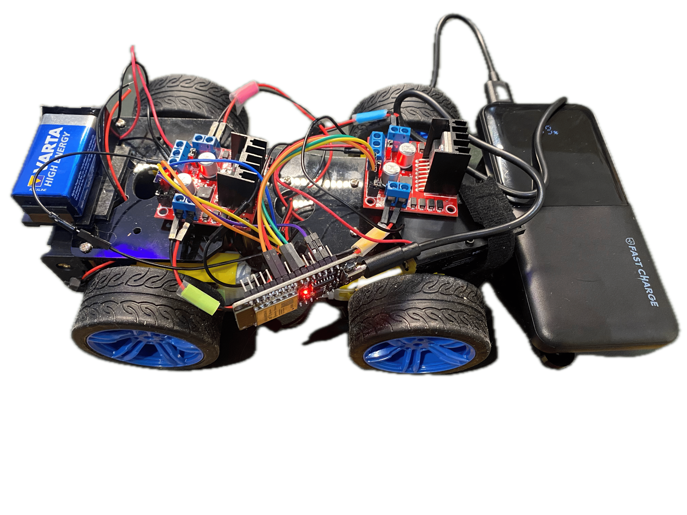

## Building a minimal robot car

You can pilot it from your local wifi network from your laptop/phone:

### BOM
- [4 wheel car chassis](https://www.kubii.com/en/robots-extensions/3773-car-chassis-robot-kit-for-raspberry-pi-and-arduino-3272496312517.html?mot_tcid=fc5f5b4a-4b19-4d77-b36e-6630a0274d86)
- 4x engine continuous current between 3 an 12 volt - recommend (6 to 8V tension)
- [4x h bridge L298N](https://electro-proto.fr/modules-gestion-moteurs-et-puissance/29-module-pour-controle-de-moteurs-a-base-de-l298n-3760373490408.html) 
- [ESP32 WRoom 32](https://www.amazon.com/ESP-WROOM-32-Development-Microcontroller-Integrated-Compatible/dp/B08D5ZD528?dib=eyJ2IjoiMSJ9.is-SH_RLGHiZZUrqvTWU_DFFr6XAPKtIzbKWDMtYTKP6_lVl7IE8BynEkyrBR_coo-GrVHkJcoilGGal9ZiaowvD3TF4kL6VFJcDTS3dpnjiY3id-Wg9HziUbuutplWqdpEgVVqkg4nUWL9eVSYsdppkLOUCTduDh1fVEDUJNyoOPT6jIyNVYxWRHJbEejLXgxYUVG-GLNP252YKRFSOL5235jsdwY9QYHMj8RNZYrM.D-4MOKq4Qnq6x01nreRU3IJ61_wwJPDIpg7Yx0Ble5A&dib_tag=se&keywords=esp32+wroom&qid=1738788227&sr=8-3) with wifi and BLE
- Powerbank of 1000mah with usb and usbc output (to power the esp32)
- 2x 9V battery with pos and neg output cable (to power the motors) 

My goal is to be able to pilot my car through wifi with a minimal web interface that I can access from my laptop or 
phone with simple controls to tell teh car to go either straight, left, right or straight. 

### Getting started

I use platform IO

Copy the `example.secrets.h` into `secrets.h` in the `include` directory to enable remote control

Build the project

Upload an monitor to get the ESP32 IP adress

Connect to your browser to pilot the car