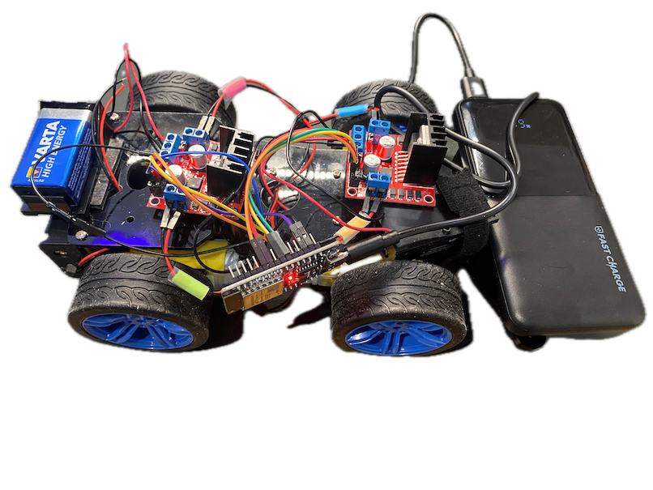

# ESP-NOW Controlled RC Car


This project documents how to build a simple remote-controlled car using an ESP32 microcontroller and the ESP-NOW
protocol for wireless communication.

> We achieved a control range of up to 115 meters between the receiver (car) and transmitter (controller).

For the controller-related parts and code, refer to the dedicated
repository: [github.com/fpaupier/car-transmitter](https://github.com/fpaupier/car-transmitter)

## Hardware - Building the car

The car uses a standard 4-wheel chassis with DC motors controlled by H-bridge motor drivers. An ESP32 serves as the
brain of the operation, receiving commands via ESP-NOW protocol from a joystick controller.

<details closed>

<summary>Click to display images</summary>




</details>

### Sourcing the components

## Bill of material - Components and their sources (prices as of March 2025)


| Component                          | Image                             | Source                                                                                                                         | Price (EUR) | Quantity | Total Price (EUR) |
|------------------------------------|-----------------------------------|--------------------------------------------------------------------------------------------------------------------------------|-------------|----------|-------------------|
| 4-wheel car chassis                |  | [Kubii](https://www.kubii.com/en/robots-extensions/3773-car-chassis-robot-kit-for-raspberry-pi-and-arduino-3272496312517.html) | 36.96       | 1        | 36.96             |
| DC Motors (3-12V)                  | *Included with chassis*           | Included with chassis                                                                                                          | -           | 4        | -                 |
| H-bridge L298N                     |   | [Amazon.fr](https://amzn.eu/d/dbmBLjt)                                                                                         | 5.34        | 2        | 10.69             |
| ESP32 WROOM-32                     |          | [Amazon.fr](https://amzn.eu/d/a1N37u4)                                                                                         | 8.99        | 1        | 8.99              |
| Powerbank (to power the ESP32)     |                                   | Generic                                                                                                                        | 15.00       | 1        | 15.00             |
| 9V Batteries (to power the motors) |                                   | [Amazon.fr](https://amzn.eu/d/emOUOg1)                                                                                         | 3.50        | 2        | 8.99              |
| Battery connectors                 |                                   | [Amazon.fr](https://amzn.eu/d/2nVmRUF)                                                                                         | 5.00        | 2        | 9.99              |
| **Total**                          |                                   |                                                                                                                                |             |          | **90.62€**        |

### Wiring Instructions

#### Motor Driver Connections

##### Front Motors (L298N 2)

| ESP32 Pin | L298N Pin | Description                         |
|-----------|-----------|-------------------------------------|
| GPIO 16   | IN1       | Front left motor forward            |
| GPIO 17   | IN2       | Front left motor backward           |
| GPIO 18   | IN3       | Front right motor forward           |
| GPIO 19   | IN4       | Front right motor backward          |
| GPIO 27   | ENA       | Front left motor PWM speed control  |
| GPIO 26   | ENB       | Front right motor PWM speed control |
| 5V        | 5V        | Logic power supply                  |
| GND       | GND       | Ground connection                   |

##### Rear Motors (L298N 1)

| ESP32 Pin | L298N Pin | Description                        |
|-----------|-----------|------------------------------------|
| GPIO 12   | IN1       | Rear left motor forward            |
| GPIO 13   | IN2       | Rear left motor backward           |
| GPIO 14   | IN3       | Rear right motor forward           |
| GPIO 15   | IN4       | Rear right motor backward          |
| GPIO 25   | ENA       | Rear left motor PWM speed control  |
| GPIO 32   | ENB       | Rear right motor PWM speed control |
| 5V        | 5V        | Logic power supply                 |
| GND       | GND       | Ground connection                  |

#### PWM Configuration

The code uses 4 PWM channels for speed control, this enables to use the analog joystick value for progressive speed.

- Channel 0: Front left motor
- Channel 1: Front right motor
- Channel 2: Rear left motor
- Channel 3: Rear right motor

PWM is configured with a frequency of 5000Hz and 8-bit resolution (0-255 values).

#### Power Connections

- ESP32: Powered via USB from the powerbank
- Motors: Powered by two 9V batteries connected to the L298N's power inputs
- Built-in LED: GPIO 2 is used for status indication

#### Power Connections

- ESP32: Powered via USB from the powerbank
- Motors: Powered by two 9V batteries connected to the L298N's power input

## Software - Code to Run the Car

> **Prerequisite**: This project uses PlatformIO to build and upload code to the ESP32. You will need to install it -
> see [PlatformIO.org](https://platformio.org/)

### Getting Your ESP32's MAC Address

Since we use [ESP-NOW](https://docs.espressif.com/projects/esp-idf/en/stable/esp32/api-reference/network/esp_now.html)
for communication, you'll need to know your car's MAC address to configure the controller. Run this code on your car's
ESP32:

```cpp

#include

void setup() {
Serial.begin(115200);
WiFi.mode(WIFI_STA); // Set as WiFi station
delay(100); // Short delay for initialization
}

void loop() {
Serial.print("ESP32 Car MAC Address: ");
Serial.println(WiFi.macAddress());
}

```

### Source Code Structure

```

car/
├── src/
│ └── main.cpp // Main program flow

```

### Getting Started

1. Clone the repository
2. Build the project using PlatformIO
3. Upload to your ESP32 and monitor the serial output
4. Use the joystick controller to pilot the car

## Troubleshooting

- If motors don't respond, check battery levels and connections
- Ensure both the car and controller are powered on
- For optimal range, keep the ESP builtin antennas unobstructed